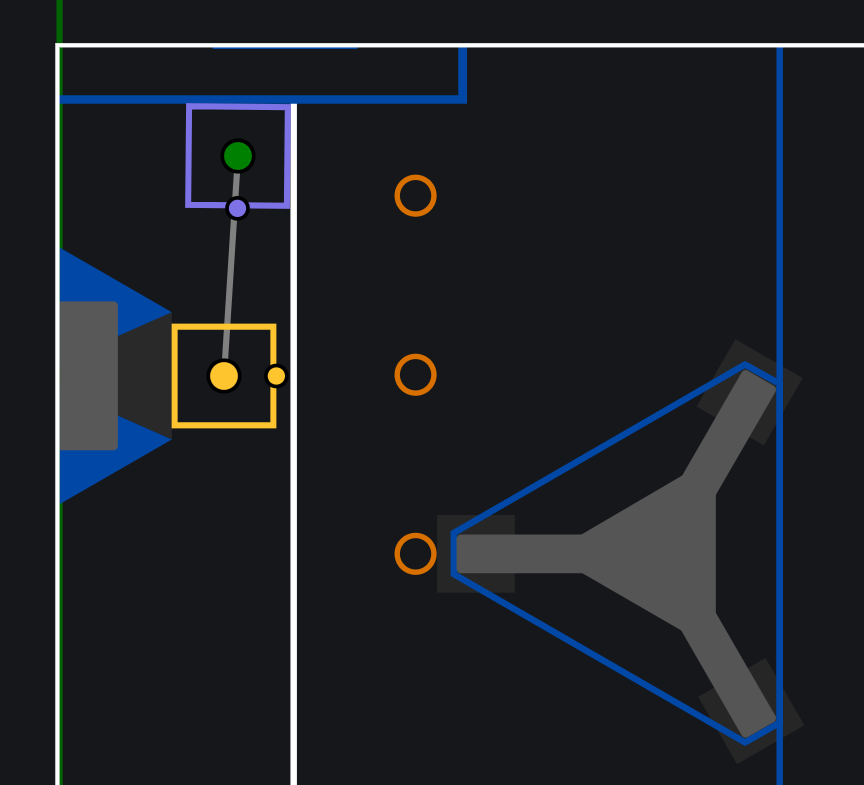

# Coding guide for Doyenne

If you're brianna, milena or avani and are reading this guide, you are in the right place!

# Pulling from github

Right now, just use the driver station computer for all github tasks.
The github interface should be in the top left hand corner
(it should be a branch symbol with "master" or some other name there).

To pull from github, open the dropdown, then click "Update project".
Then, go to "remote", "origin", then "master". Click on "master", and click
"Pull into 'master' using rebase".

NOTE: Do this the first time you make changes to the robot code, so that everything is up to date.

# Pushing to github
To push to github, click the dropdown and select "commit". Make sure to select
the "changes" checkbox. Enter the appropriate message for your change, and click 
"commit and push". 

Note: if push returns an error message, just go to the terminal(its the box with the > and _ signs),
and type in "git push origin master".

# Changing autos
To change autos, open the application "Elastic", then connect to the robot wifi.
Click on "Add Widget", open the "SmartDashboard" tab, and drag out "AutoChoices".
Make your selection from there.

Autos that 100% work: taxi
Autos that 95% work: 1 piece amp, 2-3 piece amp
Autos that 70% work: 4.5 piece speaker

You should prob test the 4.5 piece speaker once during doyenne.

# Auto starting positions

Purple is for amp autos, Yellow is for the 4.5 piece speaker. 
Ground intake side is the side with the dot on it. For taxi, u can start anywhere(duh).

# Basic code overview

To do stuff, go to src/main/kotlin/frc/robot/rigatoni. 
Click on the "subsystems" folder, and find the respective subsystem file 
(so Climber.kt, GroundIntakeSerializer.kt). Then, edit the id constant variables
(THEY_SHOULD_BE_IN_ALL_CAPS_LIKE_THIS).

To change driver/operator controller ports(they should be fine as is), go to GlobalConstants.kt.

