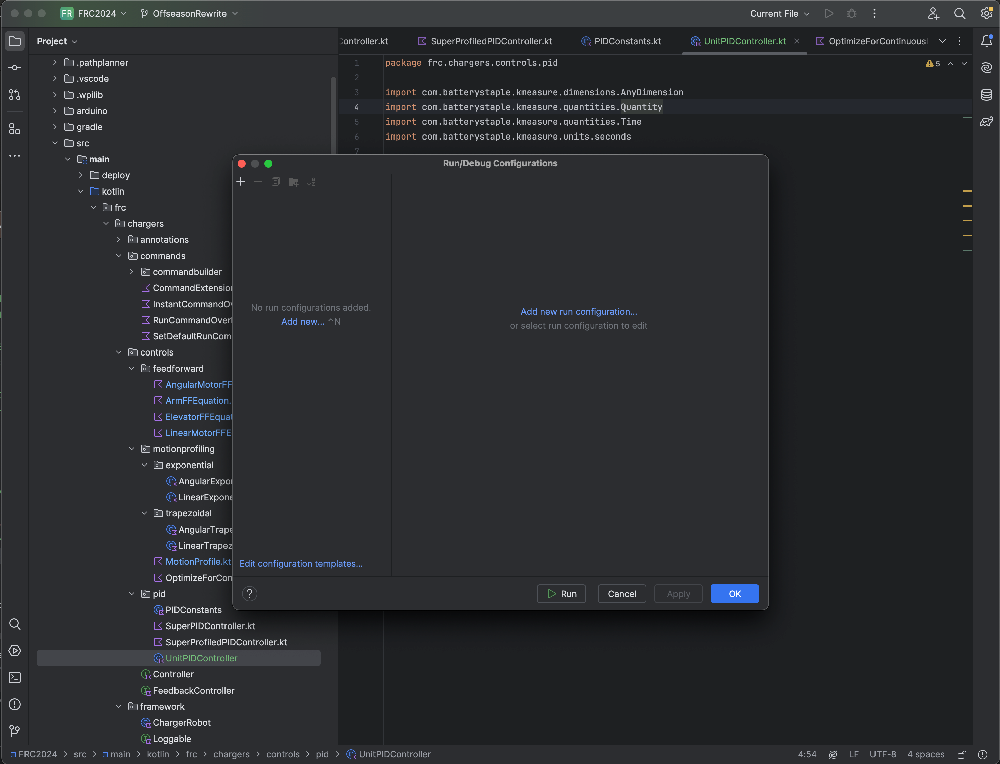
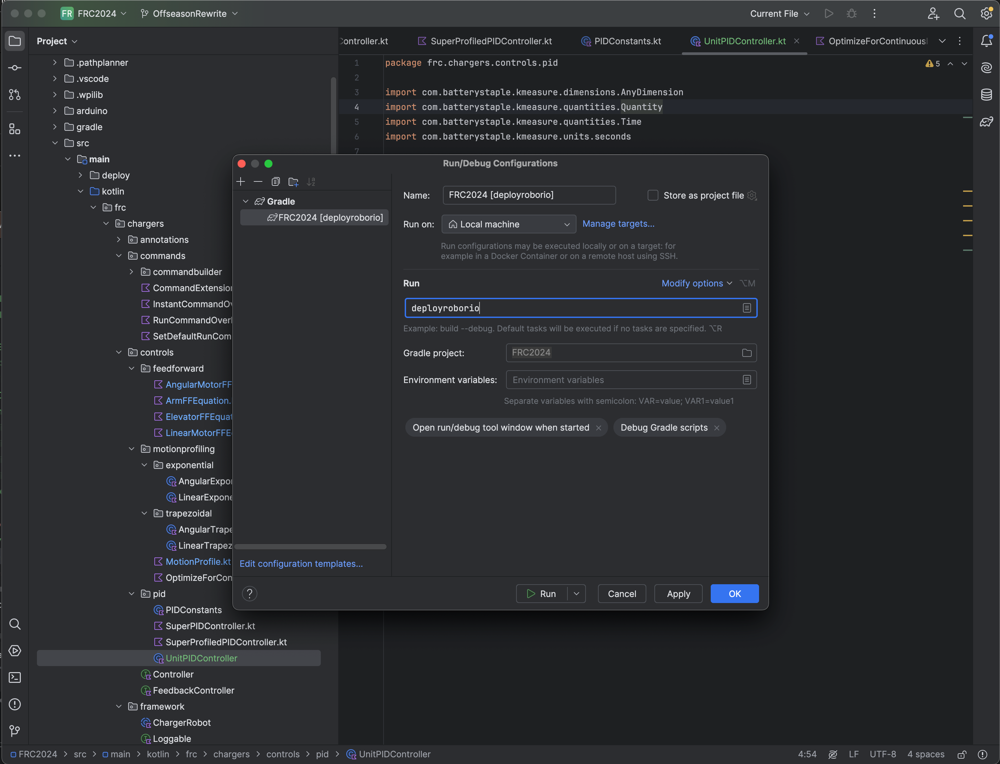

# Deploying Robot Code

Here are some simple instructions for deploying robot code.

## VSCode

To deploy robot code on WPILib VScode, 
[follow the instructions here.](https://docs.wpilib.org/en/stable/docs/software/vscode-overview/deploying-robot-code.html)

## IntelliJ

To deploy robot code on IntelliJ, follow these steps.

1. Open the project in IntelliJ.
2. Click on the "Current File" button on the top, then "Edit Configurations".
A window should pop up with the name "Run/Debug Configurations".  

3. Click "Add New Run Configuration", then "gradle". In the textbox, type
"deployroborio". Then, click Ok.  

To deploy robot code, simply connect to the robot's wifi on your computer,
and hit the run button. That's it!